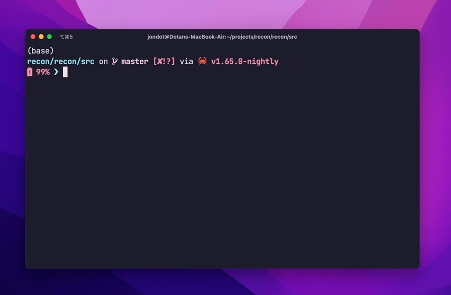

<h1 align="center">
   
   <br/>
   Recon
</h1>

<h4 align="center">Find, locate, and query files for ops and security experts</h4>
<p align="center">

</p>
<p align="center">
  <a href="#key-features">Key Features</a> •
  <a href="#how-to-use">How To Use</a> •
  <a href="#download">Download</a> •
  <a href="#contributing">Contributing</a> •
  <a href="#license">License</a>
</p>



## Key Features

* **Query with SQL over files** - find files using the full power of SQL queries
* **Find content with digests** - use SHA256/512, md5, crc32 for duplicates, and other matchers for nontrivial matches to locate artifacts on hosts
* **Find malware or binaries with YARA** - use YARA rules for matching against binary files efficiently     
* **Finetune your search runtime** - you can choose only the processing you need in order to cover more files quickly 
* **Build your own scripts** - pipe `recon` results to your own scripts with `--xargs`
* **Export** - use `--csv` or `--json`, or upload `recon.db` to your own servers for analysis

## How to Use


```
$ recon --help
SQL over files with security processing and tests

Usage: recon [OPTIONS]

Options:
  -c, --config <CONFIG_FILE>  Point to a configuration
  -r, --root <ROOT>           Target folder to scan
  -q, --query <SQL>           Query with SQL
  -f, --file <DB_FILE>        Use a specific DB file (file or :memory: for in memory) [default: recon.db]
  -d, --delete                Clear data: delete existing cache database before running
  -u, --update                Always walk files and update DB before query. Leave off to run query on existing recon.db.
  -a, --all                   Walk all files (dont consider .gitignore)
      --no-progress           Don't display progress bars
  -m, --inmem                 Don't cache index to disk, run in-memory only
      --xargs                 Output as xargs formatted list
      --json                  Output as JSON
      --csv                   Output as CSV
      --no-style              Output as a table with no styles
      --fail-some             Exit code failure if *some* files are found
      --fail-none             Exit code failure if *no* files are found
      --verbose               Show logs
  -h, --help                  Print help information
  -V, --version               Print version information
```

### Query files

By default `recon` walks the current directory and allows you to perform standard SQL queries against it:

```
$ recon -q 'select path,is_binary,mode from files limit 5'
┌───────────────┬───────────┬────────────┐
│ path          │ is_binary │ mode       │
├───────────────┼───────────┼────────────┤
│ ./os.rs       │ null      │ -rw-r--r-- │
├───────────────┼───────────┼────────────┤
│ ./out.rs      │ null      │ -rw-r--r-- │
├───────────────┼───────────┼────────────┤
│ ./bin/main.rs │ null      │ -rw-r--r-- │
├───────────────┼───────────┼────────────┤
│ ./config.rs   │ null      │ -rw-r--r-- │
├───────────────┼───────────┼────────────┤
│ ./lib.rs      │ null      │ -rw-r--r-- │
└───────────────┴───────────┴────────────┘
5 files in 16.872083ms
```

`recon` also caches the metadata it indexes in `recon.db` (an sqlite DB), to avoid re-indexing when you're experimenting with different queries.

To query against the cache (fastest, creates the cache if missing):

```
$ recon -q <your query>
```

To always update the cache before runs (good for incomplete index runs or changed folders between runs):

```
$ recon -u -q <your query>
```

To delete the cache and recreate it before runs (good for starting from scratch):

```
$ recon -d -q <your query>
```

To avoid any disk operations and run from memory (no cache):

```
$ recon -m -q <your query>
```
### Add processors and/or matchers

Configure processors and matchers in case you need some compute-heavy data to be available for query or matching such as:

* Digests or checksums (md5, SHAxxx, crc32)
* Path, content matching
* YARA rules
* For more, see [config.yaml.example](config.yaml.example)

How to know which ones you need?

* If there aren't a lot of files, you can use all of them. Generally - don't worry about it.
* If you have a performance constraint (lots of files + limited time to run full index), pick only the fields you need to query on.


Let's add binary detection:

```yaml
source:
  computed_fields:
    is_binary: true
```

> Did you know? The common way to detect if a file is binary, is to read a chunk of data from it (usually 1k bytes) and search for any non-text bytes in it. Largely: there's no built-in OS metadata "flag" that indicates if a file is a binary file.

Upon updating configuration use `-u` to update the local cache database.

```
$ recon -u -c ../config.yaml -q 'select path,is_binary,mode from files limit 6'
┌───────────────┬───────────┬────────────┐
│ path          │ is_binary │ mode       │
├───────────────┼───────────┼────────────┤
│ ./os.rs       │ 0         │ -rw-r--r-- │
├───────────────┼───────────┼────────────┤
│ ./out.rs      │ 0         │ -rw-r--r-- │
├───────────────┼───────────┼────────────┤
│ ./bin/main.rs │ 0         │ -rw-r--r-- │
├───────────────┼───────────┼────────────┤
│ ./config.rs   │ 0         │ -rw-r--r-- │
├───────────────┼───────────┼────────────┤
│ ./lib.rs      │ 0         │ -rw-r--r-- │
├───────────────┼───────────┼────────────┤
│ ./recon.db    │ 1         │ -rw-r--r-- │
└───────────────┴───────────┴────────────┘
6 files in 145.81675ms
```

## Download

For macOS:

```
brew tap rusty-ferris-club/tap && brew install recon
```

Otherwise, grab a release from [releases](https://github.com/rusty-ferris-club/recon/releases) and run `recon --help`:


## Examples

Fully configured examples ([open a PR](https://github.com/rusty-ferris-club/recon/pulls) to add your own!):

| Example                                             | Purpose                                                                |
| --------------------------------------------------- | ---------------------------------------------------------------------- |
| [all-processors.yaml](examples/all-processors.yaml) | Turn on all processors by default                                      |
| [custom-walking.yaml](examples/custom-walking.yaml) | Compute fields only for part of the walked directory tree              |
| [file-classes.yaml](examples/file-classes.yaml)     | Configure and classify your own file classes                           |
| [find-log4shell.yaml](examples/find-log4shell.yaml) | An example for finding the log4shell vulnerability using known digests |
| [using-yara.yaml](examples/using-yara.yaml)         | Using a simple YARA ruleset for matching                               |


## FAQ

<details><summary><b>
What can I use this tool for?
</b></summary>

Recon is a multi-purpose metadata indexing search and query tool with a focus on content types.

You can use it as:

* A better `find`. Find files with a more expressive SQL query abilities.
* A forensics tool: locate files matching advanced or simple criteria from machines that have issues.
* A reconnaissance tool for security experts: explore infected / suspected machines and discover and capture malware or harmful content


```
$ DATABASE_URL=sqlite::memory: recon <..args..>
```
</details>

<details><summary><b>
What are some example queries?
</b></summary>

Make sure you have a config file which configures computed fields for digests:

```yaml
# ...
  computed_fields:
    byte_type: true
    is_binary: true
    file_magic: true
    # crc32: true
    sha256: true
    sha512: true
    simhash: true
```

You can try any of these:


Show binary files only:

```
recon -c config.yaml -q 'select path from files where is_binary = 1'
```

Create a list of file digests

```
recon -c config.yaml -q 'select path,sha256,sha512 from files'
```


Export everything

```
recon -c config.yaml -q 'select * from files' --csv
```
</details>

<details><summary><b>
How can I configure cache behavior?
</b></summary>

Recon uses a sqlite database file for caching, query, and capture.

The default is to use a file called `recon.db`. You can pick your own database file name:

```
$ recon -f DB_FILE -q <query>
```
To use an inmemory database, use the special file name `:memory:`:

```
$ recon -f :memory: -q <query>
```

Or, you can use an inmemory database by giving a full URL to your database via a `DATABASE_URL` environment variable. This environment variable takes precedence over specifying a file.

```
$ DATABASE_URL=sqlite::memory: recon <..args..>
```
</details>

<details><summary><b>
How can I see what fields to select from?
</b></summary>

You can view the full schema [here](recon/migrations/1_files.sql), or issue an ad-hoc sqlite query:

```
$ recon -q 'PRAGMA table_info(files)'
```
</details>


<details><summary><b>
What are computed fields and how can I pick them?
</b></summary>

Computed fields are fields that are either compute-intensive or not always needed. You have a fully annotated [example configuration](config.yaml.example).

You can run with a configuration file:

```
$ recon -c your-config.yaml
```
</details>

<details><summary><b>
How can I use this in shell scripts?
</b></summary>

You can use `xargs` to follow with extra actions for files that you discover:


```
$ recon -q <your query> --xargs | xargs -I {} echo {}
```
</details>

<details><summary><b>
How can I capture remote state?
</b></summary>

You can send this out from a given machine using JSON:

```
$ recon -q <your query> --json | your-http-post-command
```

Or you can ship out as CSV using `--csv` or even the `recon.db` file as-is out of the machine.

</details>

<details><summary><b>
How do I run on large folders or complete disks?
</b></summary>

`recon` can run without interruption on very large folders. Each run consists of two stages:

1. Walking the file system. Here, we don't know how many files there are, so we're showing number of files indexed and time elapsed.
2. Processing compute intensive fields. Here we have a list of target files to compute, so we're showing a progress bar.

You can interrupt walking the file system, and resume it later. Use the `-u` flag to make `recon` always update DB before query, this will also make it resume any non-processed file.

```
$ recon -u <other args>
```

</details>

# Contributing

We are accepting PRs. Feel free to [submit PRs](https://github.com/rusty-ferris-club/recon/pulls).

To all [Contributors](https://github.com/rusty-ferris-club/recon/graphs/contributors) - you make this happen, thanks!

# License

Copyright (c) 2022 [@jondot](http://twitter.com/jondot). See [LICENSE](LICENSE.txt) for further details.
